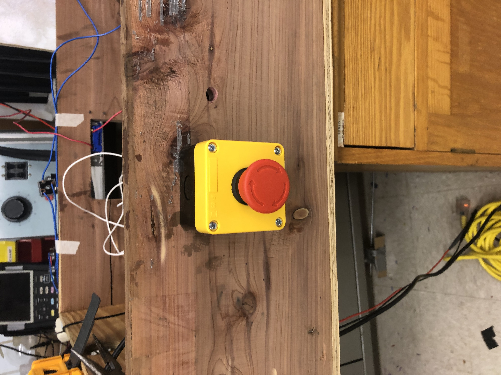

# Experimental Analysis Report

## Introduction
The purpose of the Experimental Analysis is to test if project constraints are being met and to document the experiments used to measure success.  
### Requirements Table
| **Constraint** |           **Constraint Description**                                                                                  | **Subsystem** |
|--------|-------------------------------------------------------------------------------------------------------------------------------|--------------------------|
| 1      | Shall accurately measure the electrical efficiency of the electrolyzer                                                        | Controller  |
| 2      | Display output shall be easy to read and simplistic.                                                                          | Controller  |
| 3      | The material of the electrolytic cell housing shall not be reactive with sodium hydroxide.                                    | Electrolysis  |
| 4      | The system shall include a pulse generator and permanent magnets to boost efficiency.                                         | Electrolysis  |
| 5      | The pulse generator’s output should be rectified.                                                                             | Electrolysis  |
| 6      | The water in the cell shall automatically refill when below 2/3rds of the cell's capacity.                                    | Water  |
| 7      | The water system fittings will use non-corrosive materials for fittings.                                                      | Water  |
| 8      | The water system shall prevent backwards flow of water.                                                                       | Water  |
| 9      | The system shall convert wall AC Voltage to DC voltage.                                                                       | Power  |
| 10     | The system shall be able to supply 5 VDC.                                                                                     | Power  |
| 11     | The system shall be able to supply 12 VDC.                                                                                    | Power  |
| 12     | The system shall have no dangerous exposed wires and shall be grounded as needed.                                             | Power  |
| 13     | Shall contain an emergency-stop button                                                                                        | Safety |
| 14     | Shall shutoff if pressure and temperature approach ignition conditions of Brown's gas                                         | Safety |
| 15     | System monitors must be designed with redundancies                                                                            | Safety |
| 16     | System shall not produce gas unless there is a flame present.                                                                 | Safety |
| 17     | Gas system shall prevent the backflow of flame from causing damage to the system.                                             | Gas |

## Results

### Constraint 1 - Shall accurately measure the electrical efficiency of the electrolyzer 

#### Experimental Design

#### Results

#### Conclusion

### Constraint 2 -  Display output shall be easy to read and simplistic.

#### Experimental Design

#### Results

#### Conclusion

### Constraint 3 - The material of the electrolytic cell housing shall not be reactive with sodium hydroxide.

#### Experimental Design

#### Results

#### Conclusion

### Constraint 4 - The system shall include a pulse generator and permanent magnets to boost efficiency. 

#### Experimental Design

#### Results

#### Conclusion

### Constraint 5 - The pulse generator’s output should be rectified.

#### Experimental Design

#### Results

#### Conclusion

### Constraint 6 - The water in the cell shall automatically refill when below 2/3rds of the cell's capacity. 

#### Experimental Design

#### Results

#### Conclusion

### Constraint 7 - The water system fittings will use non-corrosive materials for fittings.  

This constraint was not traditionally tested but was met. 

### Constraint 8 -  The water system shall prevent backwards flow of water. 

#### Experimental Design

A backflow valve will be fitted to the system. The system will be filled with water and then removed from the water source. The backflow valve should keep the water inside the cell.

#### Results

The backflow valve to the right of the water valve keeps the water contained inside the cell.

#### Conclusion

This constraint was met.

### Constraint 9 - The system shall convert wall AC Voltage to DC voltage. 

This constraint was not traditionally tested but was met.

### Constraint 10 - The system shall be able to supply 5 VDC.

#### Experimental Design 

The goal of this experiment is to verify that any components in the system that need 5 Volts are receiving the required power for them to function.

This was tested by placing the positive end of a Digital Multimeter along the positive 5V rail in the system and the negative end of the Multimeter along the ground rail of the system. Through this process we measured the voltage.

#### Results

The power supply is providing the correct voltage to the 5 Volt rail.

#### Conclusion

The constraint has been met.

### Constraint 11 - The system shall be able to supply 12 VDC.   

#### Experimental Design 

The goal of this experiment is to verify that any components in the system that need 12 Volts are receiving the required power for them to function.

This was tested by placing the positive end of a Digital Multimeter along the positive 12V rail in the system and the negative end of the Multimeter along the ground rail of the system. Through this process we measured the voltage.

#### Results 

##### Voltage output when the power supply is on but the system is not active.

##### Voltage output under load.

The power supply is providing the correct voltage to the 12 Volt rail, but when the cell is running, the resistance of the load is so small that the voltage drops slightly to 9 volts and the current increases to account for this voltage drop. The other circuits in the system remain at full functionality, however, so this does not affect performance in any way.

#### Conclusion

The constraint has been met.

### Constraint 12 - The system shall have no dangerous exposed wires and shall be grounded as needed.

This constraint was not traditionally tested but was met. 

### Constraint 13 - Shall contain an emergency stop button

#### Experimental Design
When the emergency stop button is pressed, the power to the pulse inverter must be cut off.

#### Results

Power to the pulse inverter is cut off when the emergency-stop button is pressed. The system stops producing gas.

#### Conclusion
Constraint was tested and passed.

### Constraint 14 - Shall shut off if pressure and temperature approach ignition conditions of Brown's gas
#### Experimental Design
When the temperature sensor reaches 100 degrees celsius or the pressure sensor reaches 15 psi, power to the pulse inverter is cut off.

#### Results
When temperature sensor reaches 100 degrees celsius, power is cut off. PRESSURE UNTESTED

#### Conclusion
Temperature constraint was tested and passed. PRESSURE UNTESTED

### Constraint 15 - System monitors must be designed with redundancies

#### Experimental Design
Relay outputs were separated and tested independently while still connected to the same circuit.

#### Results
Every Safety circuit has 2 relays that have their own independent outputs.

#### Conclusion
Constraint was tested and passed

### Constraint 16 - System shall not produce gas unless a flame is present

#### Experimental Design
Flame was held up to the flame sensor and the output was observed.

#### Results
The output of the flame sensor did not change from 0 volts. A new flame sensor has been ordered, the original flame sensor does not perform as expected.

#### Conclusion
Constraint was tested but did not pass.

### Constraint 17 - Gas system shall prevent the backflow of flame from causing damage to the system.

#### Experimental Design 
The system was turned on, the torch was removed, and no flame was lit. After some time of gas producing the flame was then lit. This caused flame to be sent backwards towards the arrestor. 

#### Results 

The water in the arrestor expelled the flame and prevented it from traveling towards the cell. 

#### Conclusion 

This constraint was met.

## Conclusion

| **Constraint** |     **Constraint Description**                                                                                        | **Constraint Met?** |
|--------|-------------------------------------------------------------------------------------------------------------------------------|--------------------------|
| 1      | Shall accurately measure the electrical efficiency of the electrolyzer                                                        | Controller  |
| 2      | Display output shall be easy to read and simplistic.                                                                          | Controller  |
| 3      | The material of the electrolytic cell housing shall not be reactive with sodium hydroxide.                                    | Electrolysis  |
| 4      | The system shall include a pulse generator and permanent magnets to boost efficiency.                                         | Electrolysis  |
| 5      | The pulse generator’s output should be rectified.                                                                             | Electrolysis  |
| 6      | The water in the cell shall automatically refill when below 2/3rds of the cell's capacity.                                    | Water  |
| 7      | The water system fittings will use non-corrosive materials for fittings                                                       | Water  |
| 8      | The water system shall prevent backwards flow of water.                                                                       | Water  |
| 9      | The system shall convert wall AC Voltage to DC voltage.                                                                       | Yes  |
| 10     | The system shall be able to supply 5 VDC.                                                                                     | Yes  |
| 11     | The system shall be able to supply 12 VDC.                                                                                    | Yes  |
| 12     | The system shall have no dangerous exposed wires and shall be grounded as needed.                                             | Yes  |
| 13     | Shall contain an emergency-stop button                                                                                        | Yes |
| 14     | Shall shutoff if pressure and temperature approach ignition conditions of Brown's gas                                         | Yes |
| 15     | System monitors must be designed with redundancies                                                                            | Yes |
| 16     | System shall not produce gas unless there is a flame present.                                                                 | No  |
| 17     | Gas system shall prevent the backflow of flame from causing damage to the system.                                             | Yes |

