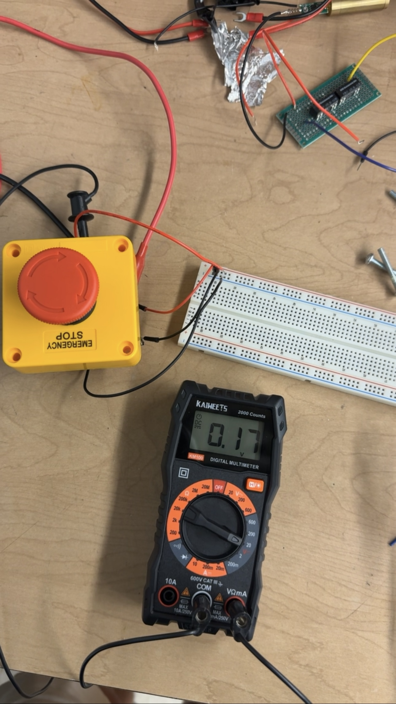

# Experimental Analysis Report

## Introduction
The purpose of the Experimental Analysis is to test if project constraints are being met and to document the experiments used to measure success.  
### Requirements Table
| **Constraint** |           **Constraint Description**                                                                                  | **Subsystem** |
|--------|-------------------------------------------------------------------------------------------------------------------------------|--------------------------|
| 1      | Shall accurately measure the electrical efficiency of the electrolyzer                                                        | Controller  |
| 2      | Display output shall be easy to read and simplistic.                                                                          | Controller  |
| 3      | The material of the electrolytic cell housing shall not be reactive with sodium hydroxide.                                    | Electrolysis  |
| 4      | The system shall include a pulse generator and permanent magnets to boost efficiency.                                         | Electrolysis  |
| 5      | The pulse generator’s output should be rectified.                                                                             | Electrolysis  |
| 6      | The water in the cell shall automatically refill when below 2/3rds of the cell's capacity.                                    | Water  |
| 7      | The water system fittings will use non-corrosive materials for fittings.                                                      | Water  |
| 8      | The water system shall prevent backwards flow of water.                                                                       | Water  |
| 9      | The system shall convert wall AC Voltage to DC voltage.                                                                       | Power  |
| 10     | The system shall be able to supply 5 VDC.                                                                                     | Power  |
| 11     | The system shall be able to supply 12 VDC.                                                                                    | Power  |
| 12     | The system shall have no dangerous exposed wires and shall be grounded as needed.                                             | Power  |
| 13     | Shall contain an emergency-stop button                                                                                        | Safety |
| 14     | Shall shutoff if pressure and temperature approach ignition conditions of Brown's gas                                         | Safety |
| 15     | System monitors must be designed with redundancies                                                                            | Safety |
| 16     | System shall not produce gas unless there is a flame present.                                                                 | Safety |
| 17     | Gas system shall prevent the backflow of flame from causing damage to the system.                                             | Gas |

## Results

### Constraint 1 - Shall accurately measure the electrical efficiency of the electrolyzer 

#### Experimental Design

First, the power used will be measured using an oscilloscope then that value will be compared to the power sensor to confirm its accuracy. Lastly, the gas flow rate will be converted to watts to compute efficiency.

#### Results

##### Current Input

##### Power sensor output

##### Flow rate sensor output in sccm

The input voltage is 12 volts. Due to the surging current, we will use the rms of the current to calculate the power into the cell. The cell had an input rms power of about 12.73 Watts. The power sensor is reading around 6-7 Watts so there is an error with the power sensor. Converting the gas output to Watts we achieve an efficiency rating of 2,600 so there is an error with how the flow rate sensor is reading.

#### Conclusion

This constraint was not met.

### Constraint 2 -  Display output shall be easy to read and simplistic.

##### The sensor data can be easily observed with appropriate units, new lines for each output were added for clarity.

#### Conclusion

Constraint was met.

### Constraint 3 - The material of the electrolytic cell housing shall not be reactive with sodium hydroxide.

This constraint was not traditionally tested but was met. 

### Constraint 4 - The system shall include a pulse generator and permanent magnets to boost efficiency. 

#### Experimental Design

The efficiency should be measured with no pulse inverter and no magnets to determine a base efficiency. Once efficiency is determined efficiency can be retested and compared to determine if there is an increase.

#### Results

A pulse generator was fitted but not the originally planned version. This pulse inverter is still a work in progress for the team. Magnets were not fitted because efficiency was not accurately determined yet.

#### Conclusion

This constraint was not met.

### Constraint 5 - The pulse generator’s output should be rectified.

##### Current Input to Pulse Inverter

##### Current Output to Pulse Inverter

The current output waveform has been rectified. The negative part of the waveform has been removed.

#### Conclusion

This constraint was met.

### Constraint 6 - The water in the cell shall automatically refill when below 2/3rds of the cell's capacity. 

#### Experimental Design

Since the cell does not use as much water as expected to conduct this experiment the water will be removed from the cell. The sensor will then be placed above and below the current water level to see how the water flow valve behaves. 

#### Results

##### Sensor placed below the water line.

##### Sensor placed above the water line.

While the sensor was not able to detect water the valve allowed water into the cell. While the sensor was able to detect water the valve was shut. The sensor is placed at the 2/3rds mark as per the constraint and has the intended behaviour of the water system.

#### Conclusion

This constraint was met.

### Constraint 7 - The water system fittings will use non-corrosive materials for fittings.  

This constraint was not traditionally tested but was met. 

### Constraint 8 -  The water system shall prevent backwards flow of water. 

#### Experimental Design

A backflow valve will be fitted to the system. The system will be filled with water and then removed from the water source. The backflow valve should keep the water inside the cell.

#### Results

The backflow valve to the right of the water valve keeps the water contained inside the cell.

#### Conclusion

This constraint was met.

### Constraint 9 - The system shall convert wall AC Voltage to DC Voltage. 

This constraint was not traditionally tested but was met.

### Constraint 10 - The system shall be able to supply 5 VDC.

#### Experimental Design 

The goal of this experiment is to verify that any components in the system that need 5 Volts are receiving the required power for them to function.

This was tested by placing the positive end of a Digital Multimeter along the positive 5V rail in the system and the negative end of the Multimeter along the ground rail of the system. Through this process, we measured the voltage.

#### Results

The power supply is providing the correct voltage to the 5 Volt rail.

#### Conclusion

The constraint has been met.

### Constraint 11 - The system shall be able to supply 12 VDC.   

#### Experimental Design 

The goal of this experiment is to verify that any components in the system that need 12 Volts are receiving the required power for them to function.

This was tested by placing the positive end of a Digital Multimeter along the positive 12V rail in the system and the negative end of the Multimeter along the ground rail of the system. Through this process we measured the voltage.

#### Results 

##### Voltage output when the power supply is on but the system is not active.

##### Voltage output under load.

The power supply is providing the correct voltage to the 12 Volt rail, but when the cell is running, the resistance of the load is so small that the voltage drops slightly to 9 volts and the current increases to account for this voltage drop. The other circuits in the system remain at full functionality, however, so this does not affect performance in any way.

#### Conclusion

The constraint has been met.

### Constraint 12 - The system shall have no dangerous exposed wires and shall be grounded as needed.

This constraint was not traditionally tested but was met. 

### Constraint 13 - Shall contain an emergency stop button

#### Experimental Design
When the emergency stop button is pressed, the power to the pulse inverter must be cut off.

#### Results

Power to the pulse inverter is cut off when the emergency-stop button is pressed. The system stops producing gas.

#### Conclusion
Constraint was tested and passed.

### Constraint 14 - Shall shut off if pressure and temperature approach ignition conditions of Brown's gas
#### Experimental Design
The temperature sensor was wired into the safety circuit. A heat gun was used to heat the temperature sensor. Since the system doesnt need to cut off at exactly 100 degrees celcius, I assume the temperature spec of the sensor is accurate enough (no temperature measurement taken). A multimeter was used to read the voltage at the output of the circuit.

The pressure sensor was wired into the safety circuit. A bike pump was used to pressurize the sensor. Since the system doent need to cut off at ecactly 15 psi, I assume the pressure spec of the sensor is accurate enough (no pressure measurement taken). A multimeter is used to read the voltage output of the circuit.

#### Results

The voltage output of the circuit drops to 0V after some time of heating the temperature sensor.

The voltage output of the circuit drops to 0V after pressurizing the sensor.

#### Conclusion
Temperature constraint was tested and passed. Pressure constraint was tested and passed.

### Constraint 15 - System monitors must be designed with redundancies

#### Experimental Design
Relay outputs were separated and tested independently while still connected to the same circuit.

#### Results

The safety circuit has 2 relays that have their own independent outputs.

#### Conclusion
Constraint was tested and passed

### Constraint 16 - System shall not produce gas unless a flame is present

#### Experimental Design
Flame was held up to the flame sensor and the output voltage was observed.

#### Results
The output of the flame sensor did not change from 0 volts. A new flame sensor has been ordered, the original flame sensor does not perform as expected.

#### Conclusion
Constraint was tested but did not pass.

### Constraint 17 - Gas system shall prevent the backflow of flame from causing damage to the system.

#### Experimental Design 
The system was turned on, the torch was removed, and no flame was lit. After some time of gas producing the flame was then lit. This caused flame to be sent backwards towards the arrestor. 

#### Results 

The water in the arrestor expelled the flame and prevented it from travelling towards the cell. 

#### Conclusion 

This constraint was met.

## Conclusion

| **Constraint** |     **Constraint Description**                                                                                        | **Constraint Met?** |
|--------|-------------------------------------------------------------------------------------------------------------------------------|--------------------------|
| 1      | Shall accurately measure the electrical efficiency of the electrolyzer                                                        | Controller  |
| 2      | Display output shall be easy to read and simplistic.                                                                          | Yes |
| 3      | The material of the electrolytic cell housing shall not be reactive with sodium hydroxide.                                    | Yes |
| 4      | The system shall include a pulse generator and permanent magnets to boost efficiency.                                         | No  |
| 5      | The pulse generator’s output should be rectified.                                                                             | Yes |
| 6      | The water in the cell shall automatically refill when below 2/3rds of the cell's capacity.                                    | Yes |
| 7      | The water system fittings will use non-corrosive materials for fittings                                                       | Yes |
| 8      | The water system shall prevent backwards flow of water.                                                                       | Yes |
| 9      | The system shall convert wall AC Voltage to DC voltage.                                                                       | Yes |
| 10     | The system shall be able to supply 5 VDC.                                                                                     | Yes |
| 11     | The system shall be able to supply 12 VDC.                                                                                    | Yes |
| 12     | The system shall have no dangerous exposed wires and shall be grounded as needed.                                             | Yes |
| 13     | Shall contain an emergency-stop button                                                                                        | Yes |
| 14     | Shall shutoff if pressure and temperature approach ignition conditions of Brown's gas                                         | Yes |
| 15     | System monitors must be designed with redundancies                                                                            | Yes |
| 16     | System shall not produce gas unless there is a flame present.                                                                 | No  |
| 17     | Gas system shall prevent the backflow of flame from causing damage to the system.                                             | Yes |

